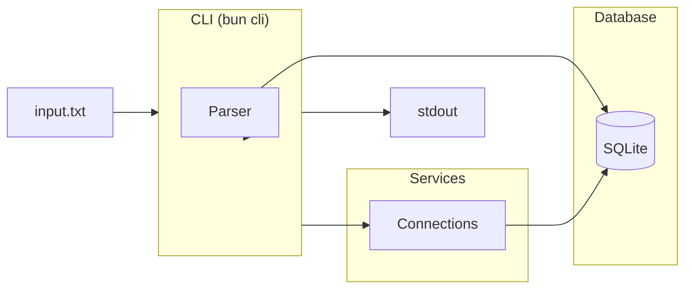
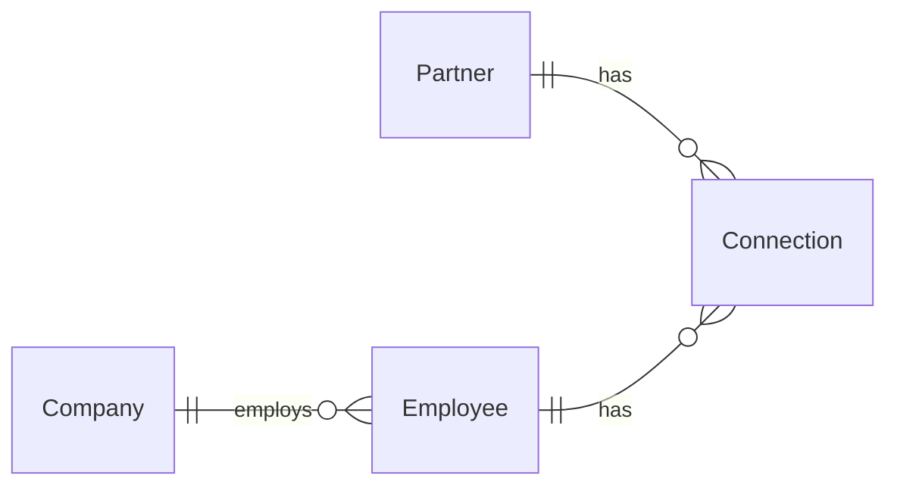

# Drive Network

Track partner-company relationships through connection events.

## Getting Started

```bash
bun install
bun cli process input.txt
```

### CLI Commands

```bash
bun cli generate
bun cli process input.txt
bun cli create <type> <args> ...
```

## Architecture

- **CLI** — Takes an input file, parses commands, outputs relationship report
- **Services** — Parsers (ingest) and Connections (query) abstract DB access
- **Storage** — SQLite for structured data

### System Diagram



### Data Model


