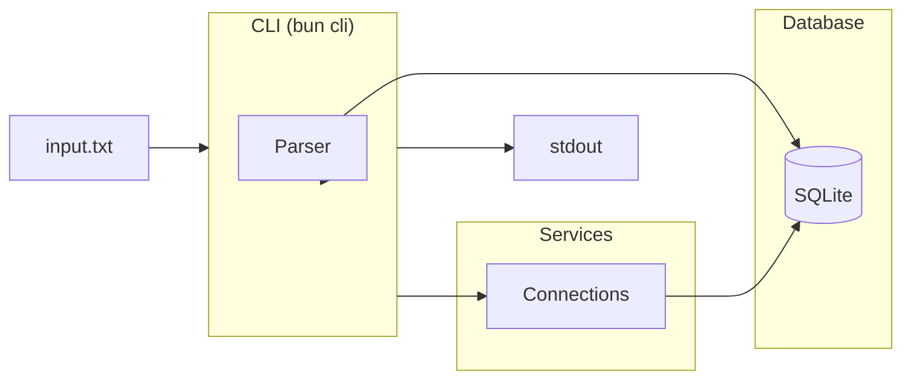
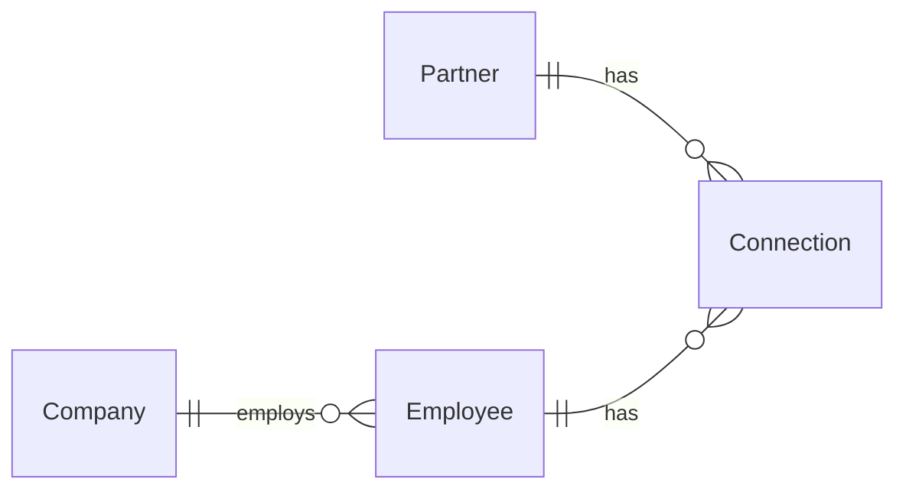

# Drive Network

Track partner-company relationships through connection events.

## Requirements

- Bun 1.3.x ([installation guide](https://bun.com/docs/installation))

## Getting Started

### Running the CLI

```bash
# Install dependencies
bun install

# Push database schema
bun db:push

# Input and process data
bun cli process input.txt
```

#### CLI Commands

```bash
bun cli generate
bun cli process input.txt
bun cli connections
bun cli create <type> <args> ...
```

### Running tests

```bash
bun test
```

## Approach & Design Decisions

I approached this problem by separating the main functions into layers that could easily hook into a more robust application. The CLI acts as a thin orchestration layer, while the core parsing and query logic live in reusable services. This isomorphic structure allows for easy monorepo expansion. Adding an API layer would just mean importing the same services the CLI uses and the frontend could easily use a shared TRPC-esque client.

**Why `SQLite & Drizzle`?** For a toy problem, in-memory data structures would suffice. But given I was asked to "treat this like a production product," I opted for persistence. SQLite keeps things simple to run (no server, single file) while Drizzle provides type-safe queries and easy migration paths if the schema evolves. It also demonstrates how I'd structure a real system where contacts accumulate over time. I would swap to a more robust database engine like Postgres in a production environment.

**Why `ts-pattern`?** Pattern matching makes the command dispatch exhaustive at compile time—if I add a new command type, TypeScript will force me to handle it. This prevents silent failures from forgotten cases.

**Extensibility baked in:** Other layers that would slot in naturally with this architecture:

- A job system for background data scraping & processing
- A REST/GraphQL API exposing the same services
- A React frontend for visualizing and traversing the network graph

### Assumptions & Edge Cases

- **Input is well-formed:** Per the spec, I assume valid formatting. I do validate argument counts, entity existence, and contact types. I normalize arguments to ensure case-insensitivity and trim whitespace but I don't handle malformed lines (e.g., missing spaces).
- **Employee names are globally unique:** As stated in the spec, no collision handling needed.
- **Tie-breaking:** If two partners have equal contact strength with a company, the first one encountered wins. This is deterministic within a single run but not explicitly alphabetical.
- **Database persists between runs:** Running `process` twice on the same file will accumulate contacts. Companies, Partners, and Employees are unique by name and therefore will not be duplicated. Clear `local.db` for a fresh state.

## Architecture

### System Diagram



### Data Model


